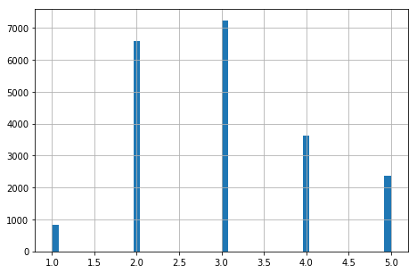
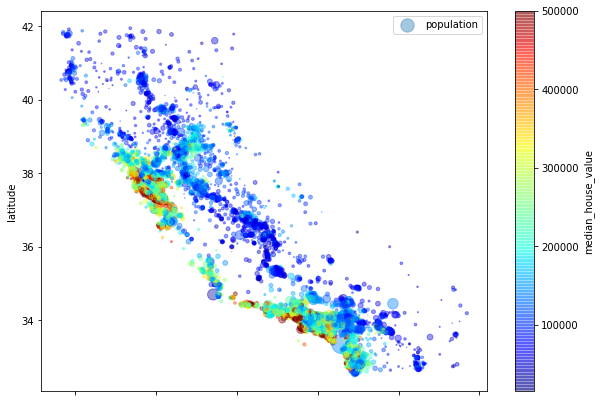
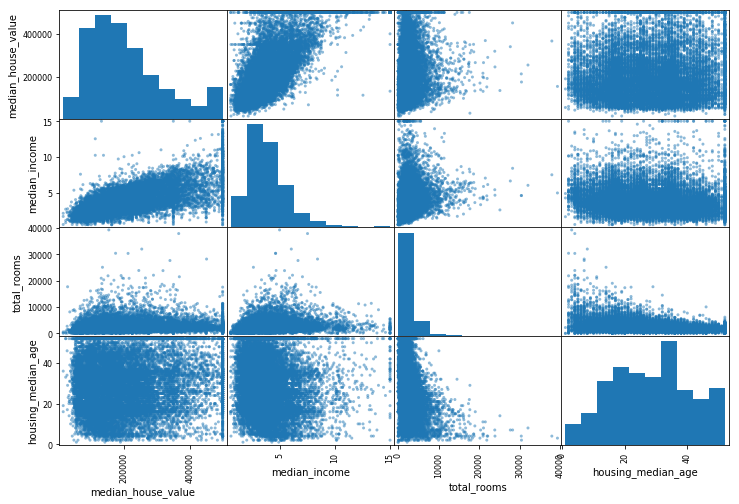

```python
import pandas as pd
import numpy as np
import os
import sys
```


```python
#loading/first view of data

housing = pd.read_csv('housing.csv')
housing.head()
```


<div>
<style scoped>
    .dataframe tbody tr th:only-of-type {
        vertical-align: middle;
    }

    .dataframe tbody tr th {
        vertical-align: top;
    }

    .dataframe thead th {
        text-align: right;
    }
</style>
<table border="1" class="dataframe">
  <thead>
    <tr style="text-align: right;">
      <th></th>
      <th>longitude</th>
      <th>latitude</th>
      <th>housing_median_age</th>
      <th>total_rooms</th>
      <th>total_bedrooms</th>
      <th>population</th>
      <th>households</th>
      <th>median_income</th>
      <th>median_house_value</th>
      <th>ocean_proximity</th>
    </tr>
  </thead>
  <tbody>
    <tr>
      <th>0</th>
      <td>-122.23</td>
      <td>37.88</td>
      <td>41.0</td>
      <td>880.0</td>
      <td>129.0</td>
      <td>322.0</td>
      <td>126.0</td>
      <td>8.3252</td>
      <td>452600.0</td>
      <td>NEAR BAY</td>
    </tr>
    <tr>
      <th>1</th>
      <td>-122.22</td>
      <td>37.86</td>
      <td>21.0</td>
      <td>7099.0</td>
      <td>1106.0</td>
      <td>2401.0</td>
      <td>1138.0</td>
      <td>8.3014</td>
      <td>358500.0</td>
      <td>NEAR BAY</td>
    </tr>
    <tr>
      <th>2</th>
      <td>-122.24</td>
      <td>37.85</td>
      <td>52.0</td>
      <td>1467.0</td>
      <td>190.0</td>
      <td>496.0</td>
      <td>177.0</td>
      <td>7.2574</td>
      <td>352100.0</td>
      <td>NEAR BAY</td>
    </tr>
    <tr>
      <th>3</th>
      <td>-122.25</td>
      <td>37.85</td>
      <td>52.0</td>
      <td>1274.0</td>
      <td>235.0</td>
      <td>558.0</td>
      <td>219.0</td>
      <td>5.6431</td>
      <td>341300.0</td>
      <td>NEAR BAY</td>
    </tr>
    <tr>
      <th>4</th>
      <td>-122.25</td>
      <td>37.85</td>
      <td>52.0</td>
      <td>1627.0</td>
      <td>280.0</td>
      <td>565.0</td>
      <td>259.0</td>
      <td>3.8462</td>
      <td>342200.0</td>
      <td>NEAR BAY</td>
    </tr>
  </tbody>
</table>
</div>


```python
housing.info()
```

    <class 'pandas.core.frame.DataFrame'>
    RangeIndex: 20640 entries, 0 to 20639
    Data columns (total 10 columns):
    longitude             20640 non-null float64
    latitude              20640 non-null float64
    housing_median_age    20640 non-null float64
    total_rooms           20640 non-null float64
    total_bedrooms        20433 non-null float64
    population            20640 non-null float64
    households            20640 non-null float64
    median_income         20640 non-null float64
    median_house_value    20640 non-null float64
    ocean_proximity       20640 non-null object
    dtypes: float64(9), object(1)
    memory usage: 1.6+ MB
    


```python
housing.describe()
```


<div>
<style scoped>
    .dataframe tbody tr th:only-of-type {
        vertical-align: middle;
    }

    .dataframe tbody tr th {
        vertical-align: top;
    }

    .dataframe thead th {
        text-align: right;
    }
</style>
<table border="1" class="dataframe">
  <thead>
    <tr style="text-align: right;">
      <th></th>
      <th>longitude</th>
      <th>latitude</th>
      <th>housing_median_age</th>
      <th>total_rooms</th>
      <th>total_bedrooms</th>
      <th>population</th>
      <th>households</th>
      <th>median_income</th>
      <th>median_house_value</th>
    </tr>
  </thead>
  <tbody>
    <tr>
      <th>count</th>
      <td>20640.000000</td>
      <td>20640.000000</td>
      <td>20640.000000</td>
      <td>20640.000000</td>
      <td>20433.000000</td>
      <td>20640.000000</td>
      <td>20640.000000</td>
      <td>20640.000000</td>
      <td>20640.000000</td>
    </tr>
    <tr>
      <th>mean</th>
      <td>-119.569704</td>
      <td>35.631861</td>
      <td>28.639486</td>
      <td>2635.763081</td>
      <td>537.870553</td>
      <td>1425.476744</td>
      <td>499.539680</td>
      <td>3.870671</td>
      <td>206855.816909</td>
    </tr>
    <tr>
      <th>std</th>
      <td>2.003532</td>
      <td>2.135952</td>
      <td>12.585558</td>
      <td>2181.615252</td>
      <td>421.385070</td>
      <td>1132.462122</td>
      <td>382.329753</td>
      <td>1.899822</td>
      <td>115395.615874</td>
    </tr>
    <tr>
      <th>min</th>
      <td>-124.350000</td>
      <td>32.540000</td>
      <td>1.000000</td>
      <td>2.000000</td>
      <td>1.000000</td>
      <td>3.000000</td>
      <td>1.000000</td>
      <td>0.499900</td>
      <td>14999.000000</td>
    </tr>
    <tr>
      <th>25%</th>
      <td>-121.800000</td>
      <td>33.930000</td>
      <td>18.000000</td>
      <td>1447.750000</td>
      <td>296.000000</td>
      <td>787.000000</td>
      <td>280.000000</td>
      <td>2.563400</td>
      <td>119600.000000</td>
    </tr>
    <tr>
      <th>50%</th>
      <td>-118.490000</td>
      <td>34.260000</td>
      <td>29.000000</td>
      <td>2127.000000</td>
      <td>435.000000</td>
      <td>1166.000000</td>
      <td>409.000000</td>
      <td>3.534800</td>
      <td>179700.000000</td>
    </tr>
    <tr>
      <th>75%</th>
      <td>-118.010000</td>
      <td>37.710000</td>
      <td>37.000000</td>
      <td>3148.000000</td>
      <td>647.000000</td>
      <td>1725.000000</td>
      <td>605.000000</td>
      <td>4.743250</td>
      <td>264725.000000</td>
    </tr>
    <tr>
      <th>max</th>
      <td>-114.310000</td>
      <td>41.950000</td>
      <td>52.000000</td>
      <td>39320.000000</td>
      <td>6445.000000</td>
      <td>35682.000000</td>
      <td>6082.000000</td>
      <td>15.000100</td>
      <td>500001.000000</td>
    </tr>
  </tbody>
</table>
</div>


```python
#plot data

%matplotlib inline

import matplotlib.pyplot as plt
housing.hist(bins=50, figsize=(20,15))
plt.show()
```


```python
from sklearn.model_selection import train_test_split

train_set, test_set = train_test_split(housing, test_size=0.2, random_state=42)
```


```python
print('Train set shape: {}, Test set shape: {}'.format(train_set.shape, test_set.shape))
```

    Train set shape: (16512, 10), Test set shape: (4128, 10)
    


```python
#creating income cat and limiting the number of cats to 5. Plot transformed data
import numpy as np
housing['income_cat']= np.ceil(housing["median_income"] / 1.5)
housing['income_cat'].where(housing["income_cat"]< 5, 5.0, inplace=True)

housing['income_cat'].hist(bins=50, figsize=(7.5,5))
plt.show()
```





```python
from sklearn.model_selection import StratifiedShuffleSplit

split = StratifiedShuffleSplit(n_splits=1, test_size=0.2, random_state=42)

for train_index, test_index in split.split(housing, housing['income_cat']):
    strat_train_set = housing.loc[train_index]
    strat_test_set = housing.loc[test_index]
    
for set_ in (strat_train_set, strat_test_set):
    set_.drop('income_cat', axis=1, inplace=True)
```


```python
#make copy of statified data for further exploration
housing = strat_train_set.copy()
housing.head()
```


<div>
<style scoped>
    .dataframe tbody tr th:only-of-type {
        vertical-align: middle;
    }

    .dataframe tbody tr th {
        vertical-align: top;
    }

    .dataframe thead th {
        text-align: right;
    }
</style>
<table border="1" class="dataframe">
  <thead>
    <tr style="text-align: right;">
      <th></th>
      <th>longitude</th>
      <th>latitude</th>
      <th>housing_median_age</th>
      <th>total_rooms</th>
      <th>total_bedrooms</th>
      <th>population</th>
      <th>households</th>
      <th>median_income</th>
      <th>median_house_value</th>
      <th>ocean_proximity</th>
    </tr>
  </thead>
  <tbody>
    <tr>
      <th>17606</th>
      <td>-121.89</td>
      <td>37.29</td>
      <td>38.0</td>
      <td>1568.0</td>
      <td>351.0</td>
      <td>710.0</td>
      <td>339.0</td>
      <td>2.7042</td>
      <td>286600.0</td>
      <td>&lt;1H OCEAN</td>
    </tr>
    <tr>
      <th>18632</th>
      <td>-121.93</td>
      <td>37.05</td>
      <td>14.0</td>
      <td>679.0</td>
      <td>108.0</td>
      <td>306.0</td>
      <td>113.0</td>
      <td>6.4214</td>
      <td>340600.0</td>
      <td>&lt;1H OCEAN</td>
    </tr>
    <tr>
      <th>14650</th>
      <td>-117.20</td>
      <td>32.77</td>
      <td>31.0</td>
      <td>1952.0</td>
      <td>471.0</td>
      <td>936.0</td>
      <td>462.0</td>
      <td>2.8621</td>
      <td>196900.0</td>
      <td>NEAR OCEAN</td>
    </tr>
    <tr>
      <th>3230</th>
      <td>-119.61</td>
      <td>36.31</td>
      <td>25.0</td>
      <td>1847.0</td>
      <td>371.0</td>
      <td>1460.0</td>
      <td>353.0</td>
      <td>1.8839</td>
      <td>46300.0</td>
      <td>INLAND</td>
    </tr>
    <tr>
      <th>3555</th>
      <td>-118.59</td>
      <td>34.23</td>
      <td>17.0</td>
      <td>6592.0</td>
      <td>1525.0</td>
      <td>4459.0</td>
      <td>1463.0</td>
      <td>3.0347</td>
      <td>254500.0</td>
      <td>&lt;1H OCEAN</td>
    </tr>
  </tbody>
</table>
</div>


```python
#plotting data points along long/lat

housing.plot(kind="scatter", x="longitude", y="latitude", alpha=0.1)
```


    <matplotlib.axes._subplots.AxesSubplot at 0x1ce987935c0>


```python
housing.plot(kind="scatter", x="longitude", y="latitude", alpha=0.4,
            s=housing['population']/100, label='population', figsize=(10,7),
            c="median_house_value", cmap=plt.get_cmap('jet'), colorbar=True,)
plt.legend()
```


    <matplotlib.legend.Legend at 0x1ce98b3e780>





```python
#claculate correlation matrix
corr_matrix = housing.corr()
```


```python
corr_matrix["median_house_value"].sort_values(ascending=False)
```


    median_house_value    1.000000
    median_income         0.687160
    total_rooms           0.135097
    housing_median_age    0.114110
    households            0.064506
    total_bedrooms        0.047689
    population           -0.026920
    longitude            -0.047432
    latitude             -0.142724
    Name: median_house_value, dtype: float64


```python
#plotting correlation matrix on data that seems correlated

from pandas.plotting import scatter_matrix

attributes = ['median_house_value', 'median_income', 'total_rooms', 'housing_median_age']

scatter_matrix(housing[attributes], figsize=(12,8))
```


    array([[<matplotlib.axes._subplots.AxesSubplot object at 0x000001CE96630FD0>,
            <matplotlib.axes._subplots.AxesSubplot object at 0x000001CE96585C18>,
            <matplotlib.axes._subplots.AxesSubplot object at 0x000001CE965BFC88>,
            <matplotlib.axes._subplots.AxesSubplot object at 0x000001CE9651B080>],
           [<matplotlib.axes._subplots.AxesSubplot object at 0x000001CE9655A278>,
            <matplotlib.axes._subplots.AxesSubplot object at 0x000001CE9655A208>,
            <matplotlib.axes._subplots.AxesSubplot object at 0x000001CE964D5D30>,
            <matplotlib.axes._subplots.AxesSubplot object at 0x000001CE963EA710>],
           [<matplotlib.axes._subplots.AxesSubplot object at 0x000001CE964260B8>,
            <matplotlib.axes._subplots.AxesSubplot object at 0x000001CE9644E160>,
            <matplotlib.axes._subplots.AxesSubplot object at 0x000001CE96318080>,
            <matplotlib.axes._subplots.AxesSubplot object at 0x000001CE963C0828>],
           [<matplotlib.axes._subplots.AxesSubplot object at 0x000001CE96CF95F8>,
            <matplotlib.axes._subplots.AxesSubplot object at 0x000001CE962A7550>,
            <matplotlib.axes._subplots.AxesSubplot object at 0x000001CE96DC4B70>,
            <matplotlib.axes._subplots.AxesSubplot object at 0x000001CE962EF240>]],
          dtype=object)





```python
#isolate most promising i.e. median income as median house value

housing.plot(kind='scatter', x='median_income', y='median_house_value', alpha=0.1)
```


    <matplotlib.axes._subplots.AxesSubplot at 0x1ce9268dd68>


```python
##creating three new attributes: rooms_per_household, bedrooms_per_room and population_per_household

housing['rooms_per_household'] = housing['total_rooms']/housing['households']
housing['bedrooms_per_room'] = housing['total_bedrooms']/housing['total_rooms']
housing['population_per_household'] = housing['population']/housing['households']

corr_matrix = housing.corr()
corr_matrix["median_house_value"].sort_values(ascending=False)
```


    median_house_value          1.000000
    median_income               0.687160
    rooms_per_household         0.146285
    total_rooms                 0.135097
    housing_median_age          0.114110
    households                  0.064506
    total_bedrooms              0.047689
    population_per_household   -0.021985
    population                 -0.026920
    longitude                  -0.047432
    latitude                   -0.142724
    bedrooms_per_room          -0.259984
    Name: median_house_value, dtype: float64


```python
housing = strat_train_set.drop('median_house_value', axis=1)
housing_labels = strat_train_set['median_house_value'].copy()
```


```python
#replace missing attribute data with median
from sklearn.preprocessing import Imputer

imputer = Imputer(strategy='median')

housing_num = housing.drop("ocean_proximity", axis=1)
imputer.fit(housing_num)

X = imputer.transform(housing_num)
housing_tr = pd.DataFrame(X, columns=housing_num.columns)
```


```python
#encoding the ocean proximity text data numerically
from sklearn.preprocessing import LabelEncoder

encoder = LabelEncoder()
housing_cat = housing['ocean_proximity']
housing_cat_encoded = encoder.fit_transform(housing_cat)
print(encoder.classes_)
housing_cat_encoded
```

    ['<1H OCEAN' 'INLAND' 'ISLAND' 'NEAR BAY' 'NEAR OCEAN']
    


    array([0, 0, 4, ..., 1, 0, 3], dtype=int64)


